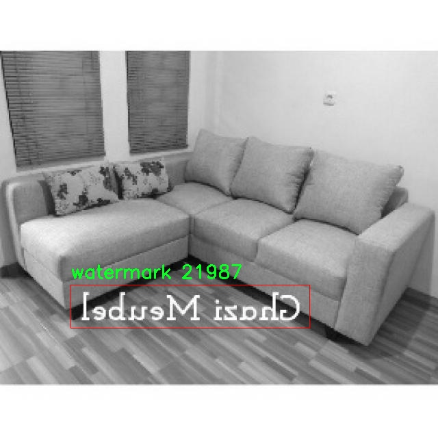

# 水印与标志检测检测系统源码分享
 # [一条龙教学YOLOV8标注好的数据集一键训练_70+全套改进创新点发刊_Web前端展示]

### 1.研究背景与意义

项目参考[AAAI Association for the Advancement of Artificial Intelligence](https://gitee.com/qunmasj/projects)

项目来源[AACV Association for the Advancement of Computer Vision](https://kdocs.cn/l/cszuIiCKVNis)

研究背景与意义

随着数字技术的迅猛发展，图像和视频内容的生成与传播变得越来越普遍，水印和标志的使用也随之增加。这些水印和标志不仅在商业领域中起到保护知识产权的作用，还在社交媒体和数字营销中扮演着重要角色。因此，开发高效的水印与标志检测系统显得尤为重要。传统的水印和标志检测方法往往依赖于人工审核或简单的图像处理技术，效率低下且易受各种因素的影响，如图像质量、光照变化等。这些问题促使研究者们寻求更为先进的解决方案。

近年来，深度学习技术的迅猛发展为图像处理领域带来了革命性的变化，尤其是在目标检测方面。YOLO（You Only Look Once）系列模型因其高效性和准确性，成为了目标检测领域的佼佼者。YOLOv8作为该系列的最新版本，进一步提升了检测精度和速度，使其在复杂场景下的应用成为可能。然而，尽管YOLOv8在许多应用中表现出色，但在水印和标志检测方面仍存在一定的局限性，尤其是在处理多类目标时的准确性和鲁棒性。

本研究旨在基于改进的YOLOv8模型，构建一个高效的水印与标志检测系统。我们将使用一个包含1600张图像的数据集，该数据集涵盖了三类目标：标签、标志和水印。这一数据集的多样性为模型的训练和测试提供了良好的基础，能够有效地模拟实际应用场景中的各种挑战。通过对YOLOv8模型的改进，我们将探索如何提高其在水印和标志检测中的表现，尤其是在复杂背景、不同尺寸和角度的情况下。

本研究的意义不仅在于提升水印与标志检测的准确性和效率，更在于为相关领域提供一种新的技术解决方案。随着电子商务和数字内容创作的蓬勃发展，水印和标志的保护需求日益增加。一个高效的检测系统能够帮助企业和个人更好地维护自己的知识产权，防止盗用和侵权行为。此外，该系统的成功实施还将为后续的研究提供宝贵的经验和数据支持，推动目标检测技术在其他领域的应用。

综上所述，基于改进YOLOv8的水印与标志检测系统的研究不仅具有重要的理论价值，也具备广泛的实际应用前景。通过对现有技术的改进和创新，我们希望能够为水印和标志的自动检测提供一种高效、准确的解决方案，从而推动相关领域的发展。

### 2.图片演示


##### 注意：由于此博客编辑较早，上面“2.图片演示”和“3.视频演示”展示的系统图片或者视频可能为老版本，新版本在老版本的基础上升级如下：（实际效果以升级的新版本为准）

  （1）适配了YOLOV8的“目标检测”模型和“实例分割”模型，通过加载相应的权重（.pt）文件即可自适应加载模型。

  （2）支持“图片识别”、“视频识别”、“摄像头实时识别”三种识别模式。

  （3）支持“图片识别”、“视频识别”、“摄像头实时识别”三种识别结果保存导出，解决手动导出（容易卡顿出现爆内存）存在的问题，识别完自动保存结果并导出到tempDir中。

  （4）支持Web前端系统中的标题、背景图等自定义修改，后面提供修改教程。

  另外本项目提供训练的数据集和训练教程,暂不提供权重文件（best.pt）,需要您按照教程进行训练后实现图片演示和Web前端界面演示的效果。

### 3.视频演示

[3.1 视频演示](https://www.bilibili.com/video/BV1dNsbebE5E/)

### 4.数据集信息展示

##### 4.1 本项目数据集详细数据（类别数＆类别名）

nc: 3
names: ['label', 'logo', 'watermark']


##### 4.2 本项目数据集信息介绍

数据集信息展示

在当今数字化时代，水印与标志的检测变得愈发重要，尤其是在保护知识产权和品牌形象方面。为此，我们构建了一个名为“repost-detection”的数据集，旨在为改进YOLOv8的水印与标志检测系统提供强有力的支持。该数据集专注于三种主要类别：标签（label）、标志（logo）和水印（watermark），这些类别的选择不仅反映了市场需求，也为研究者提供了丰富的训练和测试样本。

“repost-detection”数据集的类别数量为三，具体包括：标签、标志和水印。这三类对象在视觉内容中扮演着重要角色，标签通常用于标识产品或内容的来源，标志则是品牌识别的重要元素，而水印则是保护数字内容版权的一种手段。通过对这三类对象的有效检测，研究者可以开发出更为精准的算法，帮助企业和个人更好地管理和保护他们的数字资产。

在数据集的构建过程中，我们采用了多种数据采集和标注技术，以确保数据的多样性和准确性。首先，数据来源涵盖了多个领域，包括商业广告、社交媒体内容、新闻报道以及在线商品展示等。这种多样化的来源使得数据集能够涵盖不同场景下的标签、标志和水印，从而增强模型的泛化能力。其次，在标注过程中，我们邀请了经验丰富的标注人员，确保每个样本的标注准确无误。每个样本不仅包含了目标对象的位置信息，还附带了相应的类别标签，使得训练过程更加高效。

此外，为了提升数据集的实用性，我们还进行了数据增强处理。通过旋转、缩放、裁剪和颜色调整等手段，我们生成了大量的变体样本，以增加模型对不同视觉条件的适应能力。这种数据增强策略不仅提高了模型的鲁棒性，还有效减少了过拟合的风险，使得最终的检测系统能够在实际应用中表现得更加稳定。

在数据集的评估阶段，我们设计了一系列的基准测试，以验证改进后的YOLOv8模型在水印与标志检测任务中的性能。通过与现有的检测系统进行对比，我们能够清晰地看到改进后的模型在准确率、召回率和F1-score等指标上的提升。这些评估结果不仅证明了“repost-detection”数据集的有效性，也为后续的研究提供了宝贵的参考。

总之，“repost-detection”数据集的构建和应用，为水印与标志检测领域提供了一个坚实的基础。通过对标签、标志和水印的系统性研究，我们希望能够推动相关技术的发展，帮助企业和个人更好地保护他们的数字内容。随着技术的不断进步，我们期待看到更多基于该数据集的创新研究成果，为数字版权保护和品牌管理提供更为强大的技术支持。





### 5.全套项目环境部署视频教程（零基础手把手教学）

[5.1 环境部署教程链接（零基础手把手教学）](https://www.ixigua.com/7404473917358506534?logTag=c807d0cbc21c0ef59de5)


[5.2 安装Python虚拟环境创建和依赖库安装视频教程链接（零基础手把手教学）](https://www.ixigua.com/7404474678003106304?logTag=1f1041108cd1f708b01a)

### 6.手把手YOLOV8训练视频教程（零基础小白有手就能学会）

[6.1 手把手YOLOV8训练视频教程（零基础小白有手就能学会）](https://www.ixigua.com/7404477157818401292?logTag=d31a2dfd1983c9668658)

### 7.70+种全套YOLOV8创新点代码加载调参视频教程（一键加载写好的改进模型的配置文件）

[7.1 70+种全套YOLOV8创新点代码加载调参视频教程（一键加载写好的改进模型的配置文件）](https://www.ixigua.com/7404478314661806627?logTag=29066f8288e3f4eea3a4)

### 8.70+种全套YOLOV8创新点原理讲解（非科班也可以轻松写刊发刊，V10版本正在科研待更新）

由于篇幅限制，每个创新点的具体原理讲解就不一一展开，具体见下列网址中的创新点对应子项目的技术原理博客网址【Blog】：


[8.1 70+种全套YOLOV8创新点原理讲解链接](https://gitee.com/qunmasj/good)

### 9.系统功能展示（检测对象为举例，实际内容以本项目数据集为准）

图9.1.系统支持检测结果表格显示

  图9.2.系统支持置信度和IOU阈值手动调节

  图9.3.系统支持自定义加载权重文件best.pt(需要你通过步骤5中训练获得)

  图9.4.系统支持摄像头实时识别

  图9.5.系统支持图片识别

  图9.6.系统支持视频识别

  图9.7.系统支持识别结果文件自动保存

  图9.8.系统支持Excel导出检测结果数据


### 10.原始YOLOV8算法原理

原始YOLOv8算法原理

YOLOv8作为YOLO系列的最新版本，承载着对目标检测技术的深刻理解与创新。它的设计理念源于对以往YOLO版本的不断迭代与优化，旨在提升检测精度与速度，同时简化模型的复杂性，使其在各种应用场景中都能表现出色。YOLOv8的网络结构主要分为输入端、主干网络、Neck端和输出端四个模块，各模块之间的紧密协作使得整个模型在特征提取、融合和输出方面形成了高效的闭环。

在输入端，YOLOv8采用了一系列先进的数据增强技术，包括Mosaic数据增强、自适应图片缩放和灰度填充等。这些技术的引入不仅丰富了训练数据的多样性，还有效提升了模型对不同场景的适应能力。通过这些预处理手段，YOLOv8能够更好地捕捉到图像中的重要特征，增强了模型的鲁棒性。

主干网络是YOLOv8的核心部分，负责从输入图像中提取深层次的特征。YOLOv8在这一部分延续了PAN-FPN的结构，但进行了关键性的创新。首先，YOLOv8删除了上采样部分的卷积结构，这一设计使得网络在处理特征图时更加高效。其次，YOLOv8引入了C2f模块，该模块在C3模块的基础上结合了ELAN模块的思想，增加了更多的残差连接。这种设计不仅保持了模型的轻量化特性，还在特征提取过程中引入了丰富的梯度信息，从而提高了模型的学习能力和表现。

在Neck端，YOLOv8通过上采样、下采样和特征拼接的方式，将不同尺度的特征图进行融合，形成更为全面的特征表示。这一过程是基于PAN结构设计的，旨在有效整合来自主干网络的多层次特征，以便在后续的检测任务中能够利用更丰富的信息。通过这种特征融合，YOLOv8能够在复杂场景中更好地定位目标，提高检测的准确性。

输出端采用了当前流行的解耦合头结构，将分类和检测任务分开处理。这一创新使得模型在进行目标检测时，能够更专注于每个任务的特性，提升了整体的检测性能。同时，YOLOv8将传统的Anchor-Based方法替换为Anchor-Free策略，这一转变显著提高了检测精度，尤其是在处理小目标时表现尤为突出。解耦合头结构的设计不仅优化了计算效率，还使得模型在训练过程中更易于调整和优化。

在损失计算方面，YOLOv8采用了BCELoss作为分类损失，DFLLoss和CIoULoss作为回归损失。这种多损失函数的设计使得模型在训练过程中能够更好地平衡分类与回归任务的学习，进一步提升了检测的精度与鲁棒性。此外，YOLOv8还引入了动态Task-Aligned Assigner样本分配策略，以更合理地匹配正负样本，确保模型在训练时能够充分利用每一个样本的信息。

值得注意的是，YOLOv8在模型设置上提供了多种选择，包括n、s、m、l、x五种不同尺度的模型。这种灵活的设计使得用户可以根据具体的应用需求，选择最合适的模型进行部署。每种模型在深度、宽度和特征图的通道数上都有所不同，以达到性能的最优平衡。这种可扩展性不仅提升了YOLOv8的适用范围，也为用户提供了更多的选择空间。

综上所述，YOLOv8在原有YOLO系列的基础上，通过一系列创新和优化，形成了一个高效、精确且易于训练的目标检测模型。其在特征提取、融合、输出及损失计算等多个方面的改进，使得YOLOv8在复杂环境下依然能够保持出色的性能。尽管在某些特定场景下仍存在一定的局限性，但YOLOv8无疑为目标检测领域带来了新的机遇与挑战。随着技术的不断进步，未来的YOLO版本将可能在YOLOv8的基础上，继续推动目标检测技术的发展。


### 11.项目核心源码讲解（再也不用担心看不懂代码逻辑）

#### 11.1 ui.py

以下是对给定代码的核心部分进行保留和详细注释的版本：

```python
import sys
import subprocess

def run_script(script_path):
    """
    使用当前 Python 环境运行指定的脚本。

    Args:
        script_path (str): 要运行的脚本路径

    Returns:
        None
    """
    # 获取当前 Python 解释器的路径
    python_path = sys.executable

    # 构建运行命令，使用 streamlit 运行指定的脚本
    command = f'"{python_path}" -m streamlit run "{script_path}"'

    # 执行命令并等待其完成
    result = subprocess.run(command, shell=True)
    
    # 检查命令执行结果，如果返回码不为0，表示出错
    if result.returncode != 0:
        print("脚本运行出错。")

# 主程序入口
if __name__ == "__main__":
    # 指定要运行的脚本路径
    script_path = "web.py"  # 假设脚本在当前目录下

    # 调用函数运行脚本
    run_script(script_path)
```

### 代码核心部分及注释说明：

1. **导入模块**：
   - `sys`：用于获取当前 Python 解释器的路径。
   - `subprocess`：用于执行外部命令。

2. **`run_script` 函数**：
   - 该函数接收一个脚本路径作为参数，并使用当前 Python 环境运行该脚本。
   - 使用 `sys.executable` 获取当前 Python 解释器的路径。
   - 构建命令字符串，使用 `streamlit` 运行指定的脚本。
   - 使用 `subprocess.run` 执行命令，并等待其完成。
   - 检查命令的返回码，如果不为0，打印错误信息。

3. **主程序入口**：
   - 在 `if __name__ == "__main__":` 块中，指定要运行的脚本路径（此处假设为 "web.py"）。
   - 调用 `run_script` 函数执行该脚本。

这个代码的核心功能是通过当前 Python 环境运行一个指定的脚本，并在运行失败时提供反馈。

这个文件是一个 Python 脚本，主要功能是运行一个名为 `web.py` 的脚本，使用的是 Streamlit 库。代码的开头部分导入了必要的模块，包括 `sys`、`os` 和 `subprocess`，以及一个自定义的函数 `abs_path`，它可能用于获取文件的绝对路径。

在 `run_script` 函数中，首先获取当前 Python 解释器的路径，这通过 `sys.executable` 实现。接着，构建一个命令字符串，该命令用于在命令行中运行指定的脚本。命令的格式是使用当前的 Python 解释器运行 Streamlit，并传入要执行的脚本路径。

随后，使用 `subprocess.run` 方法执行这个命令。这个方法会在新的子进程中运行命令，并等待其完成。如果脚本运行过程中返回的状态码不为零，表示发生了错误，此时会打印出“脚本运行出错”的提示。

在文件的最后部分，使用 `if __name__ == "__main__":` 语句来确保只有在直接运行该脚本时才会执行后面的代码。这里指定了要运行的脚本路径为 `web.py`，并调用 `run_script` 函数来执行这个脚本。

总体来看，这个文件的主要作用是为一个 Streamlit 应用提供一个启动入口，通过调用 `web.py` 脚本来启动 Web 应用。

#### 11.2 70+种YOLOv8算法改进源码大全和调试加载训练教程（非必要）\ultralytics\models\yolo\segment\val.py

以下是经过简化和注释的核心代码部分，主要保留了 `SegmentationValidator` 类的关键功能和逻辑：

```python
# 导入必要的库
from multiprocessing.pool import ThreadPool
from pathlib import Path
import numpy as np
import torch
import torch.nn.functional as F
from ultralytics.utils import ops

class SegmentationValidator:
    """
    用于基于分割模型的验证的类，继承自 DetectionValidator。
    """

    def __init__(self, dataloader=None, save_dir=None, args=None):
        """初始化 SegmentationValidator，设置任务为 'segment'，并初始化指标。"""
        self.dataloader = dataloader  # 数据加载器
        self.save_dir = save_dir  # 保存目录
        self.args = args  # 参数
        self.metrics = SegmentMetrics(save_dir=self.save_dir)  # 初始化指标
        self.plot_masks = []  # 用于存储绘图的掩码
        self.process = None  # 掩码处理函数

    def preprocess(self, batch):
        """预处理批次，将掩码转换为浮点数并发送到设备。"""
        batch['masks'] = batch['masks'].to(self.device).float()  # 将掩码转换为浮点数并移动到设备
        return batch

    def init_metrics(self):
        """初始化指标并选择掩码处理函数。"""
        if self.args.save_json:
            self.process = ops.process_mask_upsample  # 更准确的掩码处理
        else:
            self.process = ops.process_mask  # 更快的掩码处理

    def postprocess(self, preds):
        """后处理 YOLO 预测，返回输出检测和原型。"""
        p = ops.non_max_suppression(preds[0], self.args.conf, self.args.iou)  # 非极大值抑制
        proto = preds[1][-1] if len(preds[1]) == 3 else preds[1]  # 获取原型
        return p, proto

    def update_metrics(self, preds, batch):
        """更新指标，计算正确的掩码和边界框。"""
        for si, (pred, proto) in enumerate(zip(preds[0], preds[1])):
            idx = batch['batch_idx'] == si  # 获取当前批次索引
            cls = batch['cls'][idx]  # 获取当前批次的类别
            bbox = batch['bboxes'][idx]  # 获取当前批次的边界框
            npr = pred.shape[0]  # 预测数量

            if npr == 0:  # 如果没有预测
                continue

            # 处理掩码
            gt_masks = batch['masks'][idx]  # 获取真实掩码
            pred_masks = self.process(proto, pred[:, 6:], pred[:, :4])  # 处理预测掩码

            # 计算正确的边界框和掩码
            correct_bboxes = self._process_batch(pred, bbox)  # 处理边界框
            correct_masks = self._process_batch(pred, gt_masks, masks=True)  # 处理掩码

            # 更新统计信息
            self.stats.append((correct_bboxes, correct_masks))

    def _process_batch(self, detections, labels, masks=False):
        """
        返回正确的预测矩阵。
        """
        if masks:
            # 计算掩码的 IoU
            iou = mask_iou(labels.view(labels.shape[0], -1), detections.view(detections.shape[0], -1))
        else:
            # 计算边界框的 IoU
            iou = box_iou(labels[:, 1:], detections[:, :4])

        return self.match_predictions(detections[:, 5], labels[:, 0], iou)  # 匹配预测

    def plot_predictions(self, batch, preds):
        """绘制批次预测的掩码和边界框。"""
        plot_images(batch['img'], preds[0], batch['masks'], paths=batch['im_file'])

    def pred_to_json(self, predn, filename, pred_masks):
        """将预测结果保存为 JSON 格式。"""
        # 将掩码编码为 RLE 格式并保存结果
        # 省略具体实现
```

### 代码说明：
1. **类的初始化**：`__init__` 方法中初始化了数据加载器、保存目录、参数和指标等。
2. **预处理**：`preprocess` 方法将输入批次中的掩码转换为浮点数并移动到指定设备。
3. **指标初始化**：`init_metrics` 方法根据是否保存 JSON 来选择掩码处理函数。
4. **后处理**：`postprocess` 方法对模型的预测结果进行非极大值抑制，并返回处理后的结果。
5. **更新指标**：`update_metrics` 方法根据预测和真实标签更新指标，计算正确的边界框和掩码。
6. **处理批次**：`_process_batch` 方法计算 IoU（交并比），用于评估预测的准确性。
7. **绘制预测**：`plot_predictions` 方法用于可视化预测结果。
8. **保存预测结果**：`pred_to_json` 方法将预测结果保存为 JSON 格式，具体实现细节省略。

通过这些核心方法，`SegmentationValidator` 类实现了对分割模型的验证功能。

这个程序文件是用于YOLOv8模型的分割任务验证的实现，主要是通过继承`DetectionValidator`类来扩展功能。首先，程序导入了一些必要的库，包括多线程处理、路径操作、NumPy和PyTorch等。接着，定义了一个`SegmentationValidator`类，该类专门用于处理分割模型的验证过程。

在初始化方法中，调用了父类的构造函数，并设置了任务类型为“segment”，同时初始化了用于计算分割指标的`SegmentMetrics`类。`preprocess`方法用于对输入的批次数据进行预处理，将掩码数据转换为浮点数并发送到指定的设备上。

`init_metrics`方法用于初始化指标，并根据是否需要保存JSON格式的结果来选择不同的掩码处理函数。`get_desc`方法返回一个格式化的字符串，描述评估指标的内容。

在`postprocess`方法中，对YOLO模型的预测结果进行后处理，返回经过非极大值抑制处理的检测结果和掩码原型。`update_metrics`方法则负责更新验证过程中计算的指标，包括对预测结果和真实标签的比较，计算正确的掩码和边界框。

`finalize_metrics`方法用于设置评估指标的速度和混淆矩阵。`_process_batch`方法是核心的处理函数，用于返回正确的预测矩阵，支持掩码和边界框的评估。

此外，`plot_val_samples`和`plot_predictions`方法用于可视化验证样本和预测结果，生成带有边界框和掩码的图像。`pred_to_json`方法则将预测结果保存为JSON格式，方便后续评估使用。

最后，`eval_json`方法用于返回COCO风格的目标检测评估指标，利用pycocotools库进行评估，并输出mAP等统计信息。整个程序的结构清晰，功能模块化，便于扩展和维护。

#### 11.3 code\ultralytics\utils\callbacks\clearml.py

以下是经过简化和注释的核心代码部分：

```python
# 导入必要的库
from ultralytics.utils import LOGGER, SETTINGS, TESTS_RUNNING

# 尝试导入 ClearML 库并进行必要的检查
try:
    assert not TESTS_RUNNING  # 确保不在测试运行中
    assert SETTINGS["clearml"] is True  # 确保集成已启用
    import clearml
    from clearml import Task
    from clearml.binding.frameworks.pytorch_bind import PatchPyTorchModelIO
    from clearml.binding.matplotlib_bind import PatchedMatplotlib

    assert hasattr(clearml, "__version__")  # 确保导入的包不是目录

except (ImportError, AssertionError):
    clearml = None  # 如果导入失败，则将 clearml 设置为 None


def _log_debug_samples(files, title="Debug Samples") -> None:
    """
    将文件（图像）作为调试样本记录到 ClearML 任务中。

    参数:
        files (list): 文件路径列表，使用 PosixPath 格式。
        title (str): 将具有相同值的图像分组的标题。
    """
    import re

    task = Task.current_task()  # 获取当前任务
    if task:  # 如果当前任务存在
        for f in files:  # 遍历文件列表
            if f.exists():  # 检查文件是否存在
                it = re.search(r"_batch(\d+)", f.name)  # 正则表达式提取批次号
                iteration = int(it.groups()[0]) if it else 0  # 获取迭代次数
                task.get_logger().report_image(  # 记录图像
                    title=title, series=f.name.replace(it.group(), ""), local_path=str(f), iteration=iteration
                )


def on_pretrain_routine_start(trainer):
    """在预训练例程开始时运行；初始化并连接/记录任务到 ClearML。"""
    try:
        task = Task.current_task()  # 获取当前任务
        if task:  # 如果当前任务存在
            # 确保自动的 pytorch 和 matplotlib 绑定被禁用
            PatchPyTorchModelIO.update_current_task(None)
            PatchedMatplotlib.update_current_task(None)
        else:  # 如果没有当前任务，则初始化一个新任务
            task = Task.init(
                project_name=trainer.args.project or "YOLOv8",  # 项目名称
                task_name=trainer.args.name,  # 任务名称
                tags=["YOLOv8"],  # 标签
                output_uri=True,
                reuse_last_task_id=False,
                auto_connect_frameworks={"pytorch": False, "matplotlib": False},  # 禁用自动连接
            )
            LOGGER.warning(
                "ClearML Initialized a new task. If you want to run remotely, "
                "please add clearml-init and connect your arguments before initializing YOLO."
            )
        task.connect(vars(trainer.args), name="General")  # 连接训练参数
    except Exception as e:
        LOGGER.warning(f"WARNING ⚠️ ClearML installed but not initialized correctly, not logging this run. {e}")


def on_train_epoch_end(trainer):
    """在 YOLO 训练的每个 epoch 结束时记录调试样本并报告当前训练进度。"""
    task = Task.current_task()  # 获取当前任务
    if task:  # 如果当前任务存在
        if trainer.epoch == 1:  # 仅在第一个 epoch 记录调试样本
            _log_debug_samples(sorted(trainer.save_dir.glob("train_batch*.jpg")), "Mosaic")
        # 报告当前训练进度
        for k, v in trainer.label_loss_items(trainer.tloss, prefix="train").items():
            task.get_logger().report_scalar("train", k, v, iteration=trainer.epoch)  # 记录训练损失
        for k, v in trainer.lr.items():
            task.get_logger().report_scalar("lr", k, v, iteration=trainer.epoch)  # 记录学习率


def on_train_end(trainer):
    """在训练完成时记录最终模型及其名称。"""
    task = Task.current_task()  # 获取当前任务
    if task:  # 如果当前任务存在
        # 记录最终结果，包括混淆矩阵和 PR 图
        files = [
            "results.png",
            "confusion_matrix.png",
            "confusion_matrix_normalized.png",
            *(f"{x}_curve.png" for x in ("F1", "PR", "P", "R")),
        ]
        files = [(trainer.save_dir / f) for f in files if (trainer.save_dir / f).exists()]  # 过滤存在的文件
        for f in files:
            _log_plot(title=f.stem, plot_path=f)  # 记录图像
        # 报告最终指标
        for k, v in trainer.validator.metrics.results_dict.items():
            task.get_logger().report_single_value(k, v)
        # 记录最终模型
        task.update_output_model(model_path=str(trainer.best), model_name=trainer.args.name, auto_delete_file=False)


# 定义回调函数
callbacks = (
    {
        "on_pretrain_routine_start": on_pretrain_routine_start,
        "on_train_epoch_end": on_train_epoch_end,
        "on_train_end": on_train_end,
    }
    if clearml
    else {}
)
```

### 代码注释说明：
1. **导入部分**：导入必要的库和模块，确保 ClearML 集成可用。
2. **日志记录函数**：`_log_debug_samples` 函数用于记录调试样本图像，`on_train_epoch_end` 和 `on_train_end` 函数用于在训练过程中记录损失和模型信息。
3. **任务初始化**：`on_pretrain_routine_start` 函数负责初始化 ClearML 任务并连接训练参数。
4. **回调函数**：定义了在不同训练阶段触发的回调函数，以便在训练过程中记录重要信息。

这个程序文件 `clearml.py` 是一个用于与 ClearML 集成的回调函数模块，主要用于在训练和验证过程中记录模型的训练进度和结果。文件中首先导入了一些必要的库和模块，包括 `clearml` 和 `Task`，并进行了基本的错误处理，以确保在不满足条件时不会引发错误。

文件中定义了一些辅助函数，例如 `_log_debug_samples` 和 `_log_plot`，它们分别用于记录调试样本和绘图结果。`_log_debug_samples` 函数接受一个文件路径列表和标题，检查每个文件是否存在，并将其作为图像记录到当前的 ClearML 任务中。`_log_plot` 函数则用于将指定路径的图像作为绘图记录，利用 Matplotlib 来处理图像并将其上传。

接下来，文件定义了一系列回调函数，这些函数在特定的训练阶段被调用。`on_pretrain_routine_start` 函数在预训练开始时被调用，负责初始化和连接 ClearML 任务，并禁用自动的 PyTorch 和 Matplotlib 绑定。`on_train_epoch_end` 函数在每个训练周期结束时被调用，记录调试样本和当前的训练进度。`on_fit_epoch_end` 函数在每个周期结束时报告模型信息，记录训练和验证的指标。`on_val_end` 函数在验证结束时记录验证结果，包括标签和预测。最后，`on_train_end` 函数在训练完成时记录最终模型及其名称，并上传最终的结果图像和指标。

最后，文件定义了一个 `callbacks` 字典，根据是否成功导入 ClearML 来决定是否注册这些回调函数。这种设计使得代码在没有 ClearML 的环境中也能正常运行。整体而言，这个模块为 YOLO 模型的训练过程提供了一个清晰的日志记录和监控机制。

#### 11.4 train.py

以下是经过简化和注释的核心代码部分：

```python
import random
import numpy as np
import torch.nn as nn
from ultralytics.data import build_dataloader, build_yolo_dataset
from ultralytics.engine.trainer import BaseTrainer
from ultralytics.models import yolo
from ultralytics.nn.tasks import DetectionModel
from ultralytics.utils import LOGGER, RANK
from ultralytics.utils.torch_utils import de_parallel, torch_distributed_zero_first

class DetectionTrainer(BaseTrainer):
    """
    基于检测模型的训练类，继承自BaseTrainer类。
    """

    def build_dataset(self, img_path, mode="train", batch=None):
        """
        构建YOLO数据集。

        参数:
            img_path (str): 包含图像的文件夹路径。
            mode (str): 模式，`train`表示训练模式，`val`表示验证模式。
            batch (int, optional): 批次大小，适用于`rect`模式。默认为None。
        """
        gs = max(int(de_parallel(self.model).stride.max() if self.model else 0), 32)  # 获取模型的最大步幅
        return build_yolo_dataset(self.args, img_path, batch, self.data, mode=mode, rect=mode == "val", stride=gs)

    def get_dataloader(self, dataset_path, batch_size=16, rank=0, mode="train"):
        """构建并返回数据加载器。"""
        assert mode in ["train", "val"]  # 确保模式有效
        with torch_distributed_zero_first(rank):  # 仅在DDP中初始化数据集
            dataset = self.build_dataset(dataset_path, mode, batch_size)  # 构建数据集
        shuffle = mode == "train"  # 训练模式下打乱数据
        workers = self.args.workers if mode == "train" else self.args.workers * 2  # 根据模式设置工作线程数
        return build_dataloader(dataset, batch_size, workers, shuffle, rank)  # 返回数据加载器

    def preprocess_batch(self, batch):
        """对图像批次进行预处理，包括缩放和转换为浮点数。"""
        batch["img"] = batch["img"].to(self.device, non_blocking=True).float() / 255  # 转换为浮点数并归一化
        if self.args.multi_scale:  # 如果启用多尺度
            imgs = batch["img"]
            sz = (
                random.randrange(self.args.imgsz * 0.5, self.args.imgsz * 1.5 + self.stride)
                // self.stride
                * self.stride
            )  # 随机选择新的图像大小
            sf = sz / max(imgs.shape[2:])  # 计算缩放因子
            if sf != 1:
                ns = [
                    math.ceil(x * sf / self.stride) * self.stride for x in imgs.shape[2:]
                ]  # 计算新的形状
                imgs = nn.functional.interpolate(imgs, size=ns, mode="bilinear", align_corners=False)  # 进行插值
            batch["img"] = imgs  # 更新批次图像
        return batch

    def get_model(self, cfg=None, weights=None, verbose=True):
        """返回YOLO检测模型。"""
        model = DetectionModel(cfg, nc=self.data["nc"], verbose=verbose and RANK == -1)  # 创建检测模型
        if weights:
            model.load(weights)  # 加载权重
        return model

    def plot_training_samples(self, batch, ni):
        """绘制带有注释的训练样本。"""
        plot_images(
            images=batch["img"],
            batch_idx=batch["batch_idx"],
            cls=batch["cls"].squeeze(-1),
            bboxes=batch["bboxes"],
            paths=batch["im_file"],
            fname=self.save_dir / f"train_batch{ni}.jpg",
            on_plot=self.on_plot,
        )

    def plot_metrics(self):
        """从CSV文件中绘制指标。"""
        plot_results(file=self.csv, on_plot=self.on_plot)  # 保存结果图
```

### 代码注释说明：
1. **类定义**：`DetectionTrainer`类继承自`BaseTrainer`，用于处理YOLO模型的训练过程。
2. **构建数据集**：`build_dataset`方法根据给定的图像路径和模式构建YOLO数据集。
3. **获取数据加载器**：`get_dataloader`方法构建并返回数据加载器，支持训练和验证模式。
4. **预处理批次**：`preprocess_batch`方法对输入的图像批次进行归一化和缩放处理。
5. **获取模型**：`get_model`方法返回一个YOLO检测模型，并可选择加载预训练权重。
6. **绘制训练样本**：`plot_training_samples`方法用于可视化训练样本及其标注。
7. **绘制指标**：`plot_metrics`方法用于从CSV文件中绘制训练过程中的指标。

以上代码及注释提供了YOLO模型训练的核心逻辑和流程。

这个程序文件 `train.py` 是一个用于训练目标检测模型的代码，主要基于 YOLO（You Only Look Once）架构。它继承自 `BaseTrainer` 类，专注于构建和训练 YOLO 模型。

首先，文件导入了一些必要的库和模块，包括数学运算、随机数生成、深度学习框架 PyTorch 相关的模块，以及 Ultralytics 提供的各种工具和函数。这些工具和函数帮助构建数据集、数据加载器、模型训练和结果可视化等。

`DetectionTrainer` 类是该文件的核心部分。它提供了多个方法来支持模型的训练过程。`build_dataset` 方法用于构建 YOLO 数据集，接收图像路径、模式（训练或验证）和批次大小作为参数。它会根据模型的步幅计算合适的图像尺寸，并调用 `build_yolo_dataset` 函数来创建数据集。

`get_dataloader` 方法用于构建数据加载器，确保在分布式训练中只初始化一次数据集。它根据训练或验证模式设置是否打乱数据，并返回构建好的数据加载器。

`preprocess_batch` 方法对输入的图像批次进行预处理，包括将图像缩放到合适的大小并转换为浮点数格式。这个过程还支持多尺度训练，通过随机选择图像大小来增强模型的鲁棒性。

`set_model_attributes` 方法用于设置模型的属性，包括类别数量和类别名称，以便模型能够正确处理不同的目标类别。

`get_model` 方法用于返回一个 YOLO 检测模型实例，可以选择加载预训练权重。

`get_validator` 方法返回一个用于验证模型性能的 `DetectionValidator` 实例，包含损失名称和其他必要参数。

`label_loss_items` 方法用于返回一个包含训练损失项的字典，便于监控训练过程中的损失变化。

`progress_string` 方法生成一个格式化的字符串，用于显示训练进度，包括当前的轮次、GPU 内存使用情况、损失值、实例数量和图像大小等信息。

`plot_training_samples` 方法用于绘制训练样本及其标注，便于可视化训练过程中的数据。

最后，`plot_metrics` 和 `plot_training_labels` 方法用于绘制训练过程中的各种指标和标签，帮助用户理解模型的训练效果和性能。

总体而言，这个文件提供了一个完整的框架，用于训练 YOLO 模型，涵盖了数据处理、模型构建、训练监控和结果可视化等多个方面。

#### 11.5 70+种YOLOv8算法改进源码大全和调试加载训练教程（非必要）\ultralytics\trackers\utils\matching.py

以下是代码中最核心的部分，并附上详细的中文注释：

```python
import numpy as np
import scipy
from scipy.spatial.distance import cdist
from ultralytics.utils.metrics import bbox_ioa

try:
    import lap  # 导入线性分配库
    assert lap.__version__  # 确保导入的包不是目录
except (ImportError, AssertionError, AttributeError):
    from ultralytics.utils.checks import check_requirements
    check_requirements('lapx>=0.5.2')  # 检查并安装lap包
    import lap

def linear_assignment(cost_matrix, thresh, use_lap=True):
    """
    使用线性分配算法进行匹配。

    参数:
        cost_matrix (np.ndarray): 包含分配成本的矩阵。
        thresh (float): 认为分配有效的阈值。
        use_lap (bool, optional): 是否使用lap.lapjv。默认为True。

    返回:
        (tuple): 包含匹配索引、未匹配的索引（来自'a'）和未匹配的索引（来自'b'）的元组。
    """
    if cost_matrix.size == 0:
        return np.empty((0, 2), dtype=int), tuple(range(cost_matrix.shape[0])), tuple(range(cost_matrix.shape[1]))

    if use_lap:
        # 使用lap库进行线性分配
        _, x, y = lap.lapjv(cost_matrix, extend_cost=True, cost_limit=thresh)
        matches = [[ix, mx] for ix, mx in enumerate(x) if mx >= 0]  # 生成匹配对
        unmatched_a = np.where(x < 0)[0]  # 找到未匹配的'a'索引
        unmatched_b = np.where(y < 0)[0]  # 找到未匹配的'b'索引
    else:
        # 使用scipy进行线性分配
        x, y = scipy.optimize.linear_sum_assignment(cost_matrix)  # 行x，列y
        matches = np.asarray([[x[i], y[i]] for i in range(len(x)) if cost_matrix[x[i], y[i]] <= thresh])
        if len(matches) == 0:
            unmatched_a = list(np.arange(cost_matrix.shape[0]))
            unmatched_b = list(np.arange(cost_matrix.shape[1]))
        else:
            unmatched_a = list(set(np.arange(cost_matrix.shape[0])) - set(matches[:, 0]))
            unmatched_b = list(set(np.arange(cost_matrix.shape[1])) - set(matches[:, 1]))

    return matches, unmatched_a, unmatched_b  # 返回匹配结果和未匹配索引

def iou_distance(atracks, btracks):
    """
    基于交并比（IoU）计算轨迹之间的成本。

    参数:
        atracks (list[STrack] | list[np.ndarray]): 轨迹'a'或边界框的列表。
        btracks (list[STrack] | list[np.ndarray]): 轨迹'b'或边界框的列表。

    返回:
        (np.ndarray): 基于IoU计算的成本矩阵。
    """
    if (len(atracks) > 0 and isinstance(atracks[0], np.ndarray)) \
            or (len(btracks) > 0 and isinstance(btracks[0], np.ndarray)):
        atlbrs = atracks  # 如果输入是边界框，直接赋值
        btlbrs = btracks
    else:
        atlbrs = [track.tlbr for track in atracks]  # 提取轨迹'a'的边界框
        btlbrs = [track.tlbr for track in btracks]  # 提取轨迹'b'的边界框

    ious = np.zeros((len(atlbrs), len(btlbrs)), dtype=np.float32)  # 初始化IoU矩阵
    if len(atlbrs) and len(btlbrs):
        # 计算IoU
        ious = bbox_ioa(np.ascontiguousarray(atlbrs, dtype=np.float32),
                        np.ascontiguousarray(btlbrs, dtype=np.float32),
                        iou=True)
    return 1 - ious  # 返回成本矩阵（1 - IoU）

def embedding_distance(tracks, detections, metric='cosine'):
    """
    基于嵌入特征计算轨迹和检测之间的距离。

    参数:
        tracks (list[STrack]): 轨迹列表。
        detections (list[BaseTrack]): 检测列表。
        metric (str, optional): 距离计算的度量方式。默认为'cosine'。

    返回:
        (np.ndarray): 基于嵌入特征计算的成本矩阵。
    """
    cost_matrix = np.zeros((len(tracks), len(detections)), dtype=np.float32)  # 初始化成本矩阵
    if cost_matrix.size == 0:
        return cost_matrix
    det_features = np.asarray([track.curr_feat for track in detections], dtype=np.float32)  # 提取检测特征
    track_features = np.asarray([track.smooth_feat for track in tracks], dtype=np.float32)  # 提取轨迹特征
    cost_matrix = np.maximum(0.0, cdist(track_features, det_features, metric))  # 计算距离
    return cost_matrix  # 返回成本矩阵

def fuse_score(cost_matrix, detections):
    """
    将成本矩阵与检测分数融合，生成单一相似度矩阵。

    参数:
        cost_matrix (np.ndarray): 包含分配成本的矩阵。
        detections (list[BaseTrack]): 带有分数的检测列表。

    返回:
        (np.ndarray): 融合后的相似度矩阵。
    """
    if cost_matrix.size == 0:
        return cost_matrix
    iou_sim = 1 - cost_matrix  # 计算IoU相似度
    det_scores = np.array([det.score for det in detections])  # 提取检测分数
    det_scores = np.expand_dims(det_scores, axis=0).repeat(cost_matrix.shape[0], axis=0)  # 扩展分数维度
    fuse_sim = iou_sim * det_scores  # 融合相似度
    return 1 - fuse_sim  # 返回融合后的成本矩阵
```

### 代码核心部分说明：
1. **线性分配**：`linear_assignment`函数实现了线性分配算法，用于根据成本矩阵匹配轨迹和检测。
2. **IoU计算**：`iou_distance`函数计算轨迹之间的交并比（IoU），用于衡量重叠程度。
3. **嵌入距离计算**：`embedding_distance`函数计算轨迹和检测之间的距离，基于它们的特征嵌入。
4. **分数融合**：`fuse_score`函数将成本矩阵与检测分数结合，生成一个综合的相似度矩阵。

这个程序文件是一个用于目标跟踪的工具模块，主要实现了基于成本矩阵的线性分配、交并比（IoU）计算、嵌入距离计算以及融合得分等功能。文件首先导入了必要的库，包括NumPy和SciPy，并且尝试导入一个名为`lap`的库，用于线性分配。如果该库未安装，则会调用`check_requirements`函数进行检查并安装。

文件中的`linear_assignment`函数用于执行线性分配。它接受一个成本矩阵、一个阈值和一个可选参数`use_lap`，用于选择使用`lap`库或`scipy`库进行分配。函数返回匹配的索引以及未匹配的索引。

`iou_distance`函数计算基于交并比的成本矩阵。它接受两个参数，分别是跟踪的边界框列表，并返回一个成本矩阵，该矩阵的值为1减去IoU值。这个函数首先判断输入的跟踪数据类型，如果是NumPy数组则直接使用，否则提取边界框的坐标。接着，它调用`bbox_ioa`函数计算IoU。

`embedding_distance`函数计算跟踪与检测之间的距离，基于特征嵌入。它接受跟踪列表和检测列表作为参数，并返回一个成本矩阵。该矩阵的计算基于特征之间的距离，使用了SciPy的`cdist`函数。

最后，`fuse_score`函数将成本矩阵与检测得分融合，生成一个相似度矩阵。它首先计算IoU相似度，然后将检测得分扩展到与成本矩阵相同的形状，最后通过相乘得到融合后的相似度矩阵。

整体来看，这个模块为YOLOv8目标检测算法提供了重要的工具函数，帮助实现目标的匹配和跟踪。

#### 11.6 code\ui_style.py

以下是提取出的核心代码部分，并添加了详细的中文注释：

```python
import base64  # 导入 base64 模块，用于进行 Base64 编码
import streamlit as st  # 导入 Streamlit 库，用于构建 Web 应用

# 读取图片并转换为 Base64
def get_base64_of_bin_file(bin_file):
    # 以二进制模式打开文件
    with open(bin_file, 'rb') as file:
        data = file.read()  # 读取文件内容
    # 将读取的二进制数据进行 Base64 编码，并返回字符串形式
    return base64.b64encode(data).decode()

# 定义 CSS 样式
def def_css_hitml():
    # 使用 Streamlit 的 markdown 功能插入自定义 CSS 样式
    st.markdown("""
        <style>
        /* 全局样式 */
        .css-2trqyj, .css-1d391kg, .st-bb, .st-at {
            font-family: 'Gill Sans', 'Gill Sans MT', Calibri, 'Trebuchet MS', sans-serif;  /* 设置字体 */
            background-color: #cadefc;  /* 设置背景颜色 */
            color: #21618C;  /* 设置字体颜色 */
        }

        /* 按钮样式 */
        .stButton > button {
            border: none;  /* 去掉按钮边框 */
            color: white;  /* 设置按钮文字颜色 */
            padding: 10px 20px;  /* 设置按钮内边距 */
            text-align: center;  /* 文本居中 */
            text-decoration: none;  /* 去掉文本装饰 */
            display: inline-block;  /* 使按钮成为块级元素 */
            font-size: 16px;  /* 设置字体大小 */
            margin: 2px 1px;  /* 设置按钮外边距 */
            cursor: pointer;  /* 鼠标悬停时显示为手型 */
            border-radius: 8px;  /* 设置按钮圆角 */
            background-color: #9896f1;  /* 设置按钮背景颜色 */
            box-shadow: 0 2px 4px 0 rgba(0,0,0,0.2);  /* 设置按钮阴影 */
            transition-duration: 0.4s;  /* 设置过渡效果时间 */
        }
        .stButton > button:hover {
            background-color: #5499C7;  /* 鼠标悬停时改变背景颜色 */
            color: white;  /* 鼠标悬停时保持文字颜色 */
            box-shadow: 0 8px 12px 0 rgba(0,0,0,0.24);  /* 鼠标悬停时改变阴影 */
        }

        /* 侧边栏样式 */
        .css-1lcbmhc.e1fqkh3o0 {
            background-color: #154360;  /* 设置侧边栏背景颜色 */
            color: #FDFEFE;  /* 设置侧边栏文字颜色 */
            border-right: 2px solid #DDD;  /* 设置右边框 */
        }

        /* 表格样式 */
        table {
            border-collapse: collapse;  /* 合并边框 */
            margin: 25px 0;  /* 设置表格外边距 */
            font-size: 18px;  /* 设置字体大小 */
            font-family: sans-serif;  /* 设置字体 */
            min-width: 400px;  /* 设置表格最小宽度 */
            box-shadow: 0 5px 15px rgba(0, 0, 0, 0.2);  /* 设置表格阴影 */
        }
        thead tr {
            background-color: #a8d8ea;  /* 设置表头背景颜色 */
            color: #ffcef3;  /* 设置表头文字颜色 */
            text-align: left;  /* 设置表头文本左对齐 */
        }
        th, td {
            padding: 15px 18px;  /* 设置单元格内边距 */
        }
        tbody tr {
            border-bottom: 2px solid #ddd;  /* 设置行底部边框 */
        }
        tbody tr:nth-of-type(even) {
            background-color: #D6EAF8;  /* 设置偶数行背景颜色 */
        }
        tbody tr:last-of-type {
            border-bottom: 3px solid #5499C7;  /* 设置最后一行底部边框 */
        }
        tbody tr:hover {
            background-color: #AED6F1;  /* 鼠标悬停时改变行背景颜色 */
        }
        </style>
        """, unsafe_allow_html=True)  # 允许使用 HTML
```

### 代码说明：
1. **导入模块**：引入 `base64` 和 `streamlit` 模块，前者用于编码，后者用于构建 Web 应用。
2. **`get_base64_of_bin_file` 函数**：该函数接受一个文件路径，读取文件内容并将其转换为 Base64 编码字符串。
3. **`def_css_hitml` 函数**：该函数定义了一系列 CSS 样式，用于美化 Streamlit 应用的界面，包括全局样式、按钮样式、侧边栏样式和表格样式。通过 `st.markdown` 方法将这些样式插入到应用中。

这个程序文件 `ui_style.py` 是一个用于 Streamlit 应用的样式定义文件。它主要通过自定义 CSS 来美化应用的界面。

首先，文件导入了 `base64` 和 `streamlit` 模块。`base64` 模块用于处理二进制数据的编码，而 `streamlit` 是一个用于快速构建数据应用的库。

接下来，定义了一个函数 `get_base64_of_bin_file(bin_file)`，该函数接收一个二进制文件的路径作为参数，打开该文件并读取其内容，然后将其转换为 Base64 编码的字符串。这种编码方式常用于在网页中嵌入图像等二进制数据。

然后，定义了 `def_css_hitml()` 函数，这个函数使用 `st.markdown()` 方法将一段 CSS 样式嵌入到 Streamlit 应用中。CSS 样式的内容包括全局样式、按钮样式、侧边栏样式、单选按钮样式、滑块样式、表格样式等。

全局样式部分设置了字体和背景颜色，按钮样式部分则定义了按钮的外观，包括边框、颜色、圆角、阴影效果以及鼠标悬停时的变化。侧边栏样式为侧边栏设置了背景色和边框。单选按钮和滑块的样式也进行了自定义，以提升用户体验。

表格样式部分定义了表格的外观，包括边框、字体、行间距、背景色等，增强了表格的可读性和美观性。

总的来说，这个文件通过自定义 CSS 来提升 Streamlit 应用的用户界面，使其更加美观和易于使用。

### 12.系统整体结构（节选）

### 整体功能和构架概括

该项目主要围绕 YOLOv8 目标检测算法的实现与应用，提供了一系列工具和模块来支持模型的训练、验证、跟踪以及用户界面的构建。项目的结构清晰，功能模块化，便于扩展和维护。核心功能包括：

1. **模型训练**：通过 `train.py` 文件实现模型的训练过程，支持数据加载、预处理、损失计算和训练监控。
2. **模型验证**：使用 `val.py` 文件进行模型验证，计算性能指标，支持分割任务的评估。
3. **目标跟踪**：通过 `matching.py` 文件实现目标的匹配和跟踪，计算 IoU 和嵌入距离等。
4. **回调机制**：`clearml.py` 文件提供与 ClearML 的集成，记录训练过程中的日志和指标。
5. **用户界面**：`ui.py` 和 `ui_style.py` 文件构建了一个美观的 Streamlit 应用界面，展示模型的训练和验证结果。
6. **工具和模块**：其他文件提供了各种工具函数和模块，支持模型的构建、预测和其他辅助功能。

### 文件功能整理表

| 文件路径                                                                                       | 功能描述                                                                                     |
|-----------------------------------------------------------------------------------------------|----------------------------------------------------------------------------------------------|
| `code/ui.py`                                                                                  | 运行 Streamlit 应用，作为用户界面的入口，调用 `web.py` 脚本。                               |
| `70+种YOLOv8算法改进源码大全和调试加载训练教程（非必要）\ultralytics\models\yolo\segment\val.py` | 实现 YOLOv8 分割模型的验证，计算性能指标并支持可视化。                                      |
| `code\ultralytics\utils\callbacks\clearml.py`                                               | 提供与 ClearML 的集成，记录训练过程中的日志和指标，支持可视化和调试样本的记录。            |
| `train.py`                                                                                    | 负责 YOLO 模型的训练过程，包括数据加载、预处理、损失计算和训练监控。                      |
| `70+种YOLOv8算法改进源码大全和调试加载训练教程（非必要）\ultralytics\trackers\utils\matching.py` | 实现目标跟踪的匹配算法，计算 IoU 和嵌入距离，融合得分。                                   |
| `code/ui_style.py`                                                                           | 定义 Streamlit 应用的样式，通过自定义 CSS 美化用户界面。                                   |
| `70+种YOLOv8算法改进源码大全和调试加载训练教程（非必要）\ultralytics\nn\extra_modules\attention.py` | 实现注意力机制模块，增强模型的特征提取能力。                                               |
| `70+种YOLOv8算法改进源码大全和调试加载训练教程（非必要）\ultralytics\models\sam\build.py`   | 构建和配置 SAM（Segment Anything Model）模型的相关功能。                                   |
| `code\ultralytics\utils\patches.py`                                                          | 提供一些补丁和修复功能，可能用于兼容性和性能优化。                                          |
| `code\ultralytics\engine\__init__.py`                                                       | 初始化引擎模块，可能包含模型训练和推理的基础设置。                                         |
| `code\ultralytics\nn\modules\utils.py`                                                       | 提供一些通用的工具函数，用于神经网络模块的构建和操作。                                      |
| `70+种YOLOv8算法改进源码大全和调试加载训练教程（非必要）\ultralytics\engine\predictor.py`     | 实现模型的预测功能，处理输入数据并返回预测结果。                                           |
| `70+种YOLOv8算法改进源码大全和调试加载训练教程（非必要）\ultralytics\hub\__init__.py`       | 可能用于模型的加载和管理，支持从 Hub 中获取模型和数据。                                     |

这个表格总结了项目中各个文件的主要功能，帮助理解项目的整体架构和模块之间的关系。

注意：由于此博客编辑较早，上面“11.项目核心源码讲解（再也不用担心看不懂代码逻辑）”中部分代码可能会优化升级，仅供参考学习，完整“训练源码”、“Web前端界面”和“70+种创新点源码”以“13.完整训练+Web前端界面+70+种创新点源码、数据集获取”的内容为准。

### 13.完整训练+Web前端界面+70+种创新点源码、数据集获取


# [下载链接：https://mbd.pub/o/bread/ZpuZk5lr](https://mbd.pub/o/bread/ZpuZk5lr)